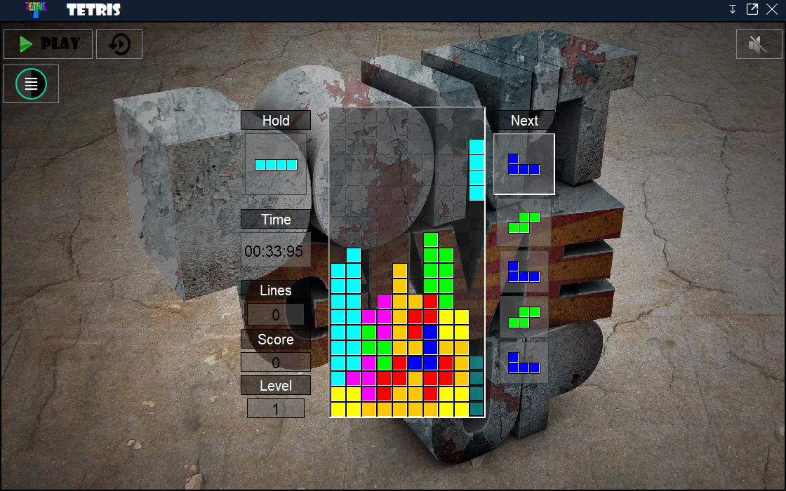

# Tetris
> Desktop Application: Design and Development of a video game in JAVA : "**TETRIS**".

The work presented in this project was carried out as part of the preparation of the basic degree in Science Mathematics and Computer Science at the Faculty of Science Dhar El Mehraz.

is in the context of a video game : **TETRIS**; is a video game developed in the Soviet Union in 1984. The game has a simple goal of destroying lines of block before it reaches the top. The line is made up of of a square block. Tetrominoes is the shape of the 4 connected blocks that falls vertically down. The player will have to use the tetrominos to create lines that fill the box horizontally, this will clear the lines of blocks. The game continues, the lines of blocks that is not completely filled will drop down as many lines that were cleared. The game has levels of difficulties which rises as the game is being played.

Our goal is to design and implement a desktop application that presents a video game and to define simple methods and graphical interfaces to use to interact with our game, have fun and at the same time develop the spirit.

All of this information was processed and analyzed using:

- A conceptual model of data (**UML**). 
- the implementation of applications by **JAVA** languages based on **SWING** and **AWT**.

 

For more information about the project please read this [pdf file](https://github.com/m-elkhou/Tetris/blob/master/Rapport/Rapport_Final.pdf) 
or this [PowerPoint file](https://github.com/m-elkhou/Tetris/blob/master/Presentation.pptx).

Screenshots of the application can be found in the [Wiki page](https://github.com/m-elkhou/Tetris/wiki).

***
### Links
- [E-mail : ](mailto:m.elkhou@hotmail.com) m.elkhou@hotmail.com
- [GitHub : ](https://github.com/m-elkhou) m-elkhou
- [Linkedin : ](https://www.linkedin.com/in/m-elkhou/) m-elkhou
